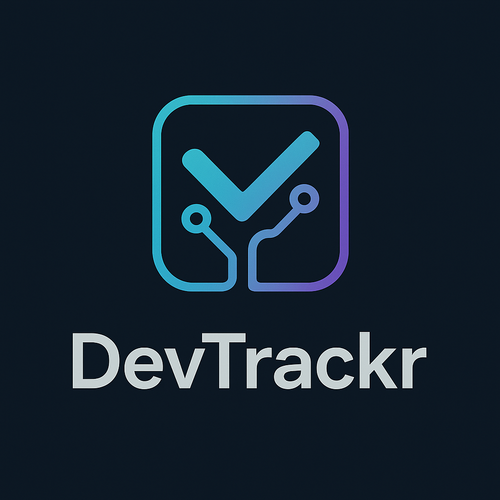

# DevTrackr

<div style="display: flex; align-items: center; gap: 20px;">
  
  <p>
    DevTrackr is a tool designed to help developers track their daily work by monitoring Jira issues and their associated pull requests. It provides a centralized way to manage and track the progress of features and bug fixes across different releases.
  </p>
</div>

## Features

- Subscribe to Jira issues and track their associated pull requests
- Monitor pull requests across different releases
- Track backports to older releases
- Get notifications about unmerged pull requests when unsubscribing
- Local database for storing subscriptions and tracking data

## Project Structure

```
.
├── api/            # API service implementation
├── cmd/            # Command-line applications
├── internal/       # Private application code
├── pkg/            # Public library code
├── assets/         # Static assets
└── docs/           # Documentation
```

## Getting Started

### Prerequisites

- Go 1.21 or later
- SQLite3
- Jira API access

### Installation

1. Clone the repository
2. Install dependencies:
   ```bash
   go mod download
   ```
3. Build the project:
   ```bash
   go build ./cmd/devtrackr
   ```

## Development

### Running the API

```bash
go run cmd/devtrackr/main.go
```

## License

This project is licensed under the MIT License - see the LICENSE file for details.
